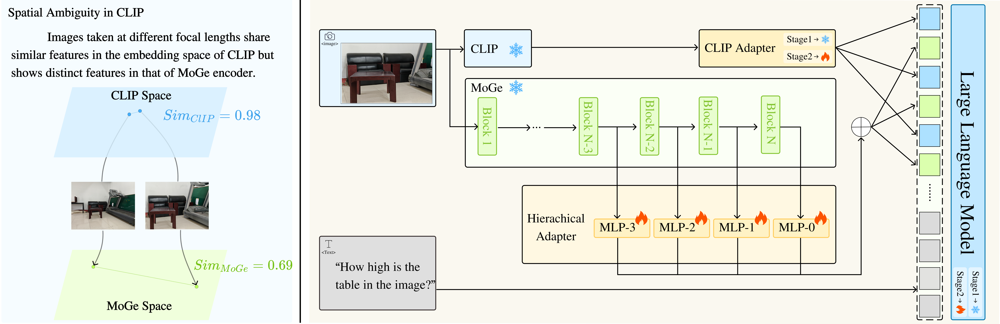
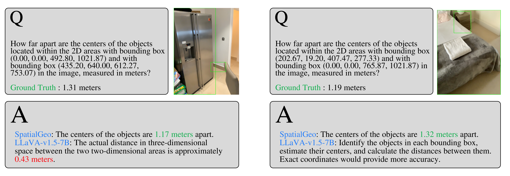
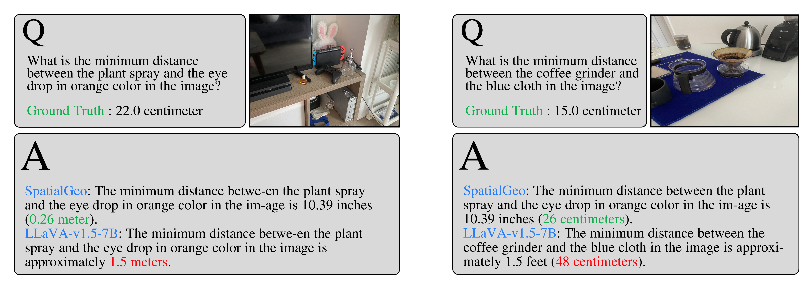
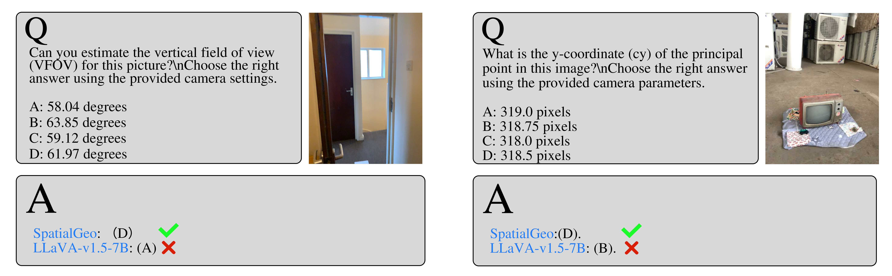

  

# SpatialGeo: Boosting Spatial Reasoning in Multimodal LLMs via Geometry-Semantics Fusion
______________________________________________________________________

***SpatialGeo*** enhances ***spatial reasoning*** in MLLMs based on the novel vision encoder generating spatial-aware visual embedding.

The overall architecture of ***SpatialGeo*** is shown in the figure below, which is composed of three major modules: 1) ***CLIP module*** with the CLIP encoder and its adapter to extract instance-level semantic features; 2) ***MoGe module*** with the MoGe encoder and its adapter to embed a mixture of geometry and semantic features; 3) ***LLM module*** with interleaved geometry and semantic embeddings together with text tokens as inputs to generate question answering.

  

   <!-- 增加一个空行 -->

______________________________________________________________________

## Code
You can obtain detailed information about the source code and model on the following website.

(https://github.com/Ricky-PLUS/SpatialGeo)
______________________________________________________________________

## Spatial VQA Datasets
We compare SpatialGeo with SOTA MLLMs, i.e., ***LLaVA-v1.5-7B*** [1], ***GPT-4.1*** [2], ***SpatialRGPT*** [3] on spatial VQA datasets, including ***SpatialRGPT-Bench*** [3] and ***SpatialScore*** [4]

______________________________________________________________________

### Examples From SpatialRGPT-Bench
We select different types of questions from ***SpatialRGPT-Bench*** for demonstration.

  <strong>Fig.1 Vertical Distance</strong> 
  

   

   <!-- 增加一个空行 -->

  <strong>Fig.2 Width Data</strong> 
  

    

   <!-- 增加一个空行 -->

  <strong>Fig.3 Height Data</strong> 
  

   <!-- 增加一个空行 -->

______________________________________________________________________

### Examples From SpatialScore
We select different types of questions from ***SpatialScore*** for presentation.

  <strong>Fig.4 Boundingboxs Distance</strong> 
  

   

   <!-- 增加一个空行 -->

  <strong>Fig.5 Objects Distance</strong> 
  

    

   <!-- 增加一个空行 -->

  <strong>Fig.6 Objects Distance</strong> 
  

    

   <!-- 增加一个空行 -->

  <strong>Fig.7 Object Localization</strong> 
  

   <!-- 增加一个空行 -->

  <strong>Fig.8 Camera and Image Transformation</strong> 
  

   <!-- 增加一个空行 -->
______________________________________________________________________

### Reference

[1] Haotian Liu, Chunyuan Li, Yuheng Li, and Yong Jae Lee. "Improved baselines with visual instruction tuning." CVPR, pp. 26296-26306. 2024.​

[2] OpenAI. "Introducing gpt-4.1 in the API." April 2025. [Online]. Available: https://openai.com/index/gpt-4-1/ 

[3] An-Chieh Cheng, Hongxu Yin, Yang Fu, Qiushan Guo, Ruihan Yang, Jan Kautz, Xiaolong Wang, and Sifei Liu. "SpatialRGPT: Grounded Spatial Reasoning in Vision-Language Models." NeurIPS, pp.135062-135093. 2025.

[4] Haoning Wu, Xiao Huang, Yaohui Chen, Ya Zhang, Yanfeng Wang, and Weidi Xie. "SpatialScore: Towards Unified Evaluation for Multimodal Spatial Understanding." arXiv preprint arXiv:2505.17012  2025.​